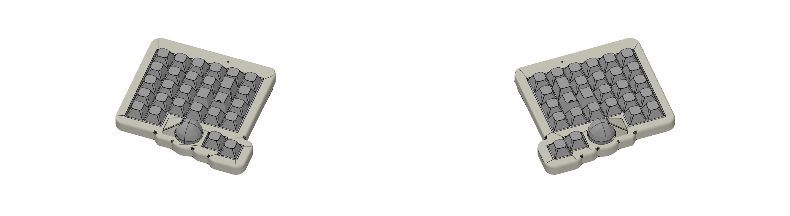
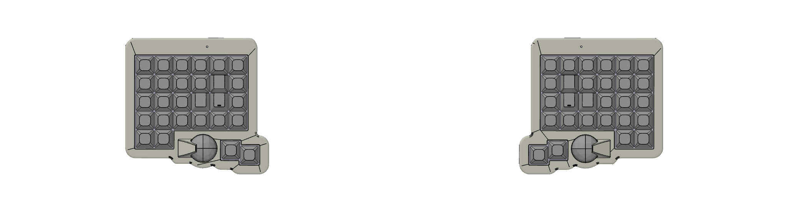

# WTB56

デュアル25mmトラックボール搭載の56キー分割キーボード

[Auto-Keyboard-Design-Kit](https://auto-kdk.pages.dev/)で生成

---

## 📸 プレビュー

### 3Dビュー



### トップビュー



---

## ⚡ 特徴

- **56キー** オルソリニア分割レイアウト
- **デュアル25mmトラックボール** センサーモジュール搭載
- **無線接続** Auto-KDK無線コントローラ使用
- **ガスケットマウント** 構造による優れた打鍵感
- **ホットスワップソケット** Choc V2スイッチ対応
- **バッテリー駆動** 充電式Li-Poバッテリー
- **コンパクト設計** 一体型トップ/ボトムケース

---

## 📋 仕様

| 項目               | 仕様                             |
| ------------------ | -------------------------------- |
| **レイアウト**     | 56キー オルソリニア (28キー × 2) |
| **スイッチタイプ** | Kailh Choc V2                    |
| **マウント方式**   | ガスケットマウント               |
| **コントローラ**   | Auto-KDK無線コントローラ × 2     |
| **トラックボール** | 25mm × 2 (PMW3360センサー)       |
| **接続方式**       | 無線 (Bluetooth)                 |
| **バッテリー**     | 301230 Li-Po (2600mAh) × 2       |
| **PCB**            | 2層基板、白シルク                |
| **ケース材質**     | 9600 Resin (SLA 3Dプリント)      |
| **プレート材質**   | 9600 Resin (SLA 3Dプリント)      |
| **サイズ**         | 238.02mm × 123.4mm (PCB寸法)     |

---

## 🛠️ パーツリスト

### 電子部品

| パーツ                                  | 数量 | 備考                                                    |
| --------------------------------------- | ---- | ------------------------------------------------------- |
| Auto-KDK無線コントローラ                | 2個  | [のぎけす屋 BOOTH](https://nogikes.booth.pm/)で購入可能 |
| コンスルー (2.5mm, 9ピン)               | 4本  | コントローラ取り付け用                                  |
| PMW3360センサーモジュール (14mm)        | 2個  | 25mmトラックボール用                                    |
| 25mmトラックボール                      | 2個  |                                                         |
| セラミックボール (1mm)                  | 6個  | トラックボール1個あたり3個                              |
| 1N4148Wダイオード (SOD-123)             | 56個 | **JLCPCBでハンダ付け済み**                              |
| Choc V2ソケット (CPG135001S30)          | 56個 | 手作業でハンダ付け必要                                  |
| Li-Poバッテリー (301230, 2600mAh)       | 2個  | 保護回路付き必須                                        |
| FFCケーブル (0.5mmピッチ, 6ピン, 100mm) | 2本  | 分割通信用                                              |

### 機構部品

| パーツ               | 数量 | 備考                                   |
| -------------------- | ---- | -------------------------------------- |
| Choc V2スイッチ      | 56個 | お好みの軸                             |
| Chocキーキャップ     | 56個 | 1Uサイズ                               |
| USB-Cケーブル        | 1本  | 充電用                                 |
| M2ネジ (4mm)         | 20本 | ケース組み立て用                       |
| M2ナット             | 20個 | ケース組み立て用                       |
| ポロンフォーム (2mm) | 2枚  | レーザーカット済みガスケットマウント用 |
| ゴム足               | 8個  | ボトムケース用                         |

### ケース・プレート部品

| パーツ            | 数量 | 材質       | 製法           |
| ----------------- | ---- | ---------- | -------------- |
| トップケース (左) | 1個  | 9600 Resin | SLA 3Dプリント |
| トップケース (右) | 1個  | 9600 Resin | SLA 3Dプリント |
| ボトムケース (左) | 1個  | 9600 Resin | SLA 3Dプリント |
| ボトムケース (右) | 1個  | 9600 Resin | SLA 3Dプリント |
| プレート (左)     | 1個  | 9600 Resin | SLA 3Dプリント |
| プレート (右)     | 1個  | 9600 Resin | SLA 3Dプリント |

---

## 📂 リポジトリ構成

```
WTB56/
├── README.md                         # このファイル
├── WTB56.json                        # Auto-KDK設計ファイル
├── .github/
│   └── workflows/
│       └── build.yml                 # ZMKファームウェア自動ビルド
├── boards/
│   ├── arm/
│   │   └── akdk_bt1/
│   │       └── akdk_bt1.yml          # ボード定義
│   └── shields/
│       └── wtb56/
│           ├── wtb56.keymap          # シールドキーマップ（config参照）
│           ├── wtb56.zmk.yml         # ZMKシールド定義
│           ├── wtb56_left.conf       # 左側設定
│           ├── wtb56_left.overlay    # 左側デバイスツリー
│           ├── wtb56_right.conf      # 右側設定
│           ├── wtb56_right.overlay   # 右側デバイスツリー
│           └── layouts.dtsi          # 物理レイアウト定義
├── config/
│   ├── wtb56.keymap                 # キーマップ設定
│   ├── west.yml                      # West依存関係
│   ├── info.json                     # キーボード情報
│   └── locale/
│       └── keys_ja.h                 # 日本語キーボードレイアウト定義
├── pcb/
│   ├── WTB56-left-pcb.json           # 左側PCBデータ
│   ├── WTB56-right-pcb.json          # 右側PCBデータ
│   └── WTB56-panelized-pcb.json      # パネライズPCBデータ
├── images/                           # プレビュー画像
│   ├── WTB56-case-preview.png
│   └── WTB56-top-view.png
└── zephyr/
    └── module.yml                    # Zephyrモジュール定義
```

---

## 🏭 製造ガイド

### PCB製造 (JLCPCB)

1. [JLCPCB](https://jlcpcb.com/)にアクセスしてアカウント作成
2. `gerber/`フォルダからGerberファイルをアップロード
3. 以下のオプションを選択:
   - **PCB Qty**: 5枚
   - **PCB Thickness**: 1.6mm
   - **PCB Color**: White
   - **Surface Finish**: HASL (with lead) *コスト削減のため推奨*
   - **Copper Weight**: 1 oz

4. **PCB Assembly**を有効化:
   - **PCBA Type**: Economic
   - **Assembly Side**: Bottom Side ⚠️ **重要**
   - **Tooling holes**: Added by JLCPCB

5. `bom/`フォルダからBOMとCPLファイルをアップロード
   - ⚠️ 「U1, R, L が見つからない」警告は無視してOK
   - ⚠️ **Chocソケットは在庫切れなら選択解除** - 手作業でハンダ付け

6. 部品配置が**底面**にあることを確認
7. カートに追加してチェックアウト

**費用目安**: 約¥4,500-5,000 (5セット分)

---

### ケース・プレート製造 (JLC3DP)

1. [JLC3DP](https://jlc3dp.com/)にアクセス

2. `case/`フォルダから6つのSTLファイルをすべてアップロード:

   - `WTB56-left-top-case.stl`
   - `WTB56-right-top-case.stl`
   - `WTB56-left-bottom-case.stl`
   - `WTB56-right-bottom-case.stl`
   - `WTB56-left-plate.stl`
   - `WTB56-right-plate.stl`

3. 仕様を選択:

   - **3D Technology**: 9600 Resin (SLA)
   - **Color**: Matte White
   - **Surface Finish**: Yes (サンディング)
   - **商品概要**: プラスチックキーボードエンクロージャ

4. **⚠️ 重要**: ボトムケース用に3D備考欄に記入:

   ```
   Please do not over-polish the small protrusions.
   They are important mounting features.
   ```

   （日本語訳: 小さな突起を研磨しすぎないでください。重要な取り付け部品です。）

5. カートに追加してチェックアウト

**費用目安**: 約¥3,500-4,500 (6パーツ)

> **注意**: Auto-KDKは2025年4月に研磨で突起が削られるのを防ぐため突起サイズを大きくしました。大きすぎてトップケースに入らない場合は、ヤスリや爪切りで小さくしてください。

---

### フォーム製造 (遊舎工房)

1. [遊舎工房レーザー加工サービス](https://yushakobo.jp/product/lasercut-service/)にアクセス

2. 見積もり依頼フォームに記入

3. `foam/`フォルダから両方のSVGファイルを添付:

   - `WTB56-left-foam.svg`
   - `WTB56-right-foam.svg`

4. 仕様:

   - **材質**: ポロンフォーム 2mm厚
   - **サイズ**: 500mm × 300mm（または必要に応じて）
   - **数量**: 2枚（左+右）

5. **メールに必ず記載する重要事項**:

   ```
   パーツの変形について理解しています。
   一部のパスが近接していますが、設計通りの加工をお願いします。
   フォームデータにはボトムフォームとガスケットマウント用フォームが
   複数個連結されています。
   ```

6. 見積もりを待つ（1-3営業日）

7. 見積もり確認後、発注

**費用目安**: 約¥3,500-4,000

---

## 🔧 組み立てガイド

### ステップ1: PCB確認

1. ✅ **ダイオードはJLCPCBでハンダ付け済み** (280個)
2. PCBに製造不良がないか検査
3. 必要に応じてフラックス残渣をクリーニング

### ステップ2: Chocソケットをハンダ付け

1. Choc V2ソケットをPCBの**底面**に配置
2. 全56個のソケットをハンダ付け（片側28個）
3. フラックスを使用して良好なハンダ接合を確保
4. すべてのピンが正しくハンダ付けされているか確認

### ステップ3: コントローラ取り付け

1. コンスルーピンをAuto-KDKコントローラに差し込む
2. コンスルーをコントローラにハンダ付け
3. コントローラをPCBソケットに差し込む
4. コンスルーをPCBにハンダ付け

### ステップ4: トラックボール組み立て

1. PMW3360センサーモジュールをPCBに取り付け
2. セラミックボールを取り付け（トラックボール1個あたり3個）
3. 25mmトラックボールを配置
4. トラックボールの動作をテスト

### ステップ5: バッテリー取り付け

1. Li-Poバッテリーをコントローラに接続
   - ⚠️ **保護回路付きのバッテリーを必ず使用**
   - ⚠️ **200mA以上の充電電流に対応** (0.5C充電の場合は容量400mAh以上)
2. 両面テープでバッテリーを固定
3. バッテリーケーブルを整線

### ステップ6: ケース組み立て

1. ボトムケースの取り付けポイントにガスケットフォームを配置
2. スイッチを取り付けたプレートをトップケースに装着
3. 左右をFFCケーブルで接続
   - ⚠️ **左右を別々のPCに接続しないこと** - キーボードとPC両方が破損する危険があります
4. トップケースとボトムケースを位置合わせ
5. M2ネジを挿入してナットで締める
6. ボトムケースにゴム足を貼り付け

### ステップ7: ファームウェア書き込み

1. USB経由でキーボードを接続
2. 接続中にBOOTパッドをショート、またはブートローダーキーを押す
3. GitHub Actionsで自動ビルドされたファームウェア（UF2）を書き込み
4. すべてのキーとトラックボールをテスト
5. 必要に応じて`config/wtb56.keymap`をカスタマイズ

---

## ⚠️ 安全上の警告

### バッテリーの安全

- ✅ **必ず保護回路付きのLi-Poバッテリーを使用**
- ✅ **200mA以上の充電に対応**したバッテリーを使用 (0.5C充電の場合は容量400mAh以上)
- ✅ Li-Poバッテリーの安全ガイドラインを読んで従う
- ❌ **絶対に**損傷または膨張したバッテリーを使用しない
- ❌ **絶対に**バッテリー端子をショートさせない
- ❌ **絶対に**高温にさらさない

### 分割キーボードの警告

- ⚠️ **重要**: 中央のUSBコネクタはPC接続用です
- ⚠️ **重要**: 両側のコネクタは分割キーボード通信専用です
- ❌ **絶対に左右を別々のPCに接続しないでください**
- ⚠️ これを行うと**キーボードとPC両方が破損**する可能性があります

**本キットの使用に関するトラブルについて、当方では一切の責任を負いません。**

---

## 🎨 カスタマイズ

### ファームウェアカスタマイズ

このキーボードはZMKファームウェアを使用しています。以下をカスタマイズ可能:

- キーマッピング
- トラックボール感度・スクロール方向
- マクロとレイヤー
- タップ/ホールド動作
- Bluetooth設定

`config/wtb56.keymap`を編集し、GitHubにプッシュすると自動でファームウェアがビルドされます。

### ケースの改造

STLファイルは以下のソフトで編集可能:

- FreeCAD
- Fusion 360
- Blender
- OpenSCAD

### 設計の変更

キーボードレイアウトを変更するには:

1. Auto-KDKの`Import`ボタンで`WTB56.json`をインポート
2. レイアウト、トラックボール位置などを変更
3. 更新された設計ファイルをエクスポート
4. 新しいファイルで再製造

---

## 💰 費用内訳

### 製造費用

| 項目                         | 費用 (円)   |
| ---------------------------- | ----------- |
| PCB + PCBA (5セット)         | ¥4,857      |
| 3Dプリントケース (6パーツ)   | ¥4,537      |
| レーザーカットフォーム (2枚) | ¥3,750      |
| **製造合計**                 | **¥13,144** |

### 部品費用（未所有の場合）

| 項目                           | 費用 (円)   |
| ------------------------------ | ----------- |
| Auto-KDKコントローラ × 2       | ¥9,250      |
| PMW3360センサーモジュール × 2  | ¥10,250     |
| 25mmトラックボール × 2         | ¥2,770      |
| Choc V2ソケット × 56           | ¥2,800      |
| Li-Poバッテリー × 2            | ¥1,728      |
| FFCケーブル × 2                | ¥2,260      |
| Choc V2スイッチ × 56           | ¥4,480      |
| Chocキーキャップ × 56          | ¥5,600      |
| ハードウェア（ネジ、ゴム足等） | ¥1,700      |
| **部品合計**                   | **¥40,838** |

### 総費用

**初回ビルド**: ¥53,982（全部品込み）  
**2回目以降**: ¥13,144（製造のみ、工具・予備部品を再利用）

> **注意**: PCBは5セット単位で製造されるため、1回の注文で5台のキーボードを製作可能です。1台あたりのコスト: 部品込みで約¥14,000

---

## 🔗 リソース

### 公式リンク

- [Auto-KDK Webアプリ](https://auto-kdk.pages.dev/)
- [Auto-KDK GitHub](https://github.com/sekigon-gonnoc/auto-kdk)
- [Auto-KDK ドキュメント](https://sekigon-gonnoc.github.io/auto-kdk/)

### 購入リンク

- [Auto-KDKコントローラ - のぎけす屋 BOOTH](https://nogikes.booth.pm/)
- [JLCPCB (PCB製造)](https://jlcpcb.com/)
- [JLC3DP (3Dプリント)](https://jlc3dp.com/)
- [遊舎工房 (スイッチ、キーキャップ、フォーム)](https://yushakobo.jp/)
- [TALP KEYBOARD](https://talpkeyboard.net/)

### コミュニティ

- [Auto-KDK Twitter: @_gonnoc](https://twitter.com/_gonnoc)
- [#auto_kdk ハッシュタグ](https://twitter.com/hashtag/auto_kdk)

---

## 📝 ビルドログ

### プロジェクトタイムライン

- **2025-12-21**: Auto-KDKで設計完了
- **2025-12-21**: JLCPCBにPCB発注（注文番号 #W202512211546I045）
- **2025-12-21**: JLC3DPにケース発注（注文番号 #W202512211552I090）
- **2025-12-21**: 遊舎工房にフォーム発注（注文番号 #Y101685）
- **2025-12-24~30**: パーツ到着予定
- **2026-01**: 組み立て予定

### 設計メモ

#### トラックボール配置

DRCエラーを回避するため、トラックボールのY座標を慎重に調整:

- **左トラックボール**: Y = 4.645mm
- **右トラックボール**: Y = 4.665mm

Auto-KDKは絶対座標系を使用しているため、右側のミラーリング時もY値の符号は反転しません。

#### マウント方式

ガスケットマウントを選択した理由:

- より良い打鍵音響
- 一体型マウントより優れた打鍵感
- 3Dプリントプレートとの柔軟性

#### 材質選択

ケース・プレートに**9600 Resin**を選択（MJF Nylonではなく）:

- ✅ マットホワイトが選択可能（MJFは黒/グレーのみ）
- ✅ サンディング仕上げで滑らかな表面
- ✅ 低コスト
- ✅ キーボード用途には十分な強度
- ⚠️ ナイロンより耐衝撃性は低い（許容可能なトレードオフ）

---

## 🤝 コントリビューション

これは個人プロジェクトですが、以下は自由に:

- このリポジトリをフォーク
- 独自のバリエーションを作成
- `#auto_kdk`と`#WTB56`でビルドをSNSでシェア

---

## 📜 ライセンス

このキーボード設計はAuto-KDKを使用して生成されました。

Auto-KDKのライセンスに従い:

- ✅ **商用利用が可能**
- ✅ 余ったPCBをBOOTH等で販売可能
- ✅ 設計ファイルは自由に改変・再配布可能

### 謝辞

- **Auto-KDK** by [@_gonnoc](https://twitter.com/_gonnoc)
- **設計ツール**: [Auto-Keyboard-Design-Kit](https://auto-kdk.pages.dev/)

---

## 📮 お問い合わせ

このビルドに関する質問:

- GitHub Issues: (このリポジトリにissueを作成)

Auto-KDK全般に関する質問:

- [Auto-KDK公式リポジトリ](https://github.com/sekigon-gonnoc/auto-kdk)をご覧ください

---

**Auto-KDKで ❤️ を込めて製作**

**最終更新**: 2025-12-21
